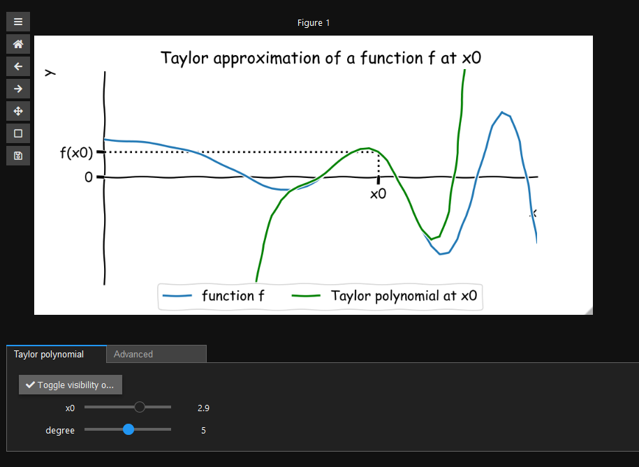

# Truncated Taylor series Approximation

[](https://share.streamlit.io/joergbrech/truncated-taylor-series/main)
[](https://creativecommons.org/licenses/by-sa/4.0/)

This is a simple web app demonstrating the truncated Taylor series approximation of a function. [Click here](https://share.streamlit.io/joergbrech/truncated-taylor-series/main) to launch the app. This app is built using python and streamlit.



To run locally, enter the following commands into a terminal to install all requirements first:

```
git clone https://github.com/joergbrech/truncated-taylor-series.git
cd truncated-taylor-series
pip install -r requirements.txt
```

Start the app with

```
streamlit run streamlit_app.py
```

Your browser should now open and display the app.
